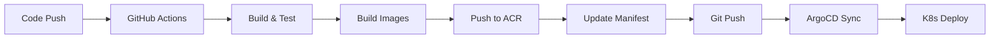

# ArgoCD 기반 GitHub Actions CI/CD 파이프라인 구축 결과

## 📋 작업 개요
GitHub Actions를 이용한 백엔드 서비스 CI/CD 파이프라인을 ArgoCD 연동 방식으로 구축했습니다.

## 🔧 실행 정보
- **시스템명**: phonebill
- **ACR**: acrdigitalgarage01
- **리소스 그룹**: rg-digitalgarage-01
- **AKS 클러스터**: aks-digitalgarage-01
- **매니페스트 레포지토리**: https://github.com/hyeda2020/phonebill.git
- **백엔드 서비스**: api-gateway, user-service, bill-service, product-service, kos-mock

## 🚀 구축된 CI/CD 파이프라인

### 파이프라인 구조
```
CI (GitHub Actions) → ArgoCD → K8s 배포
```

### 주요 단계
1. **Build and Test** - 소스 빌드 및 테스트 실행
2. **Build and Push Docker Images** - 컨테이너 이미지 빌드 및 ACR 푸시
3. **Update Manifest Repository** - Kustomize 매니페스트 업데이트 (ArgoCD 트리거)
4. **Notify Results** - 결과 알림

## 📁 생성된 파일

### `.github/workflows/backend-cicd-argocd.yaml`
ArgoCD 연동 GitHub Actions 워크플로우 파일이 생성되었습니다.

#### 주요 특징:
- **브랜치별 환경 분리**:
  - `main` → `prod` 환경
  - `develop` → `dev` 환경
- **서비스별 Docker 이미지 빌드**: 5개 백엔드 서비스 자동 처리
- **매니페스트 자동 업데이트**: Kustomize를 통한 이미지 태그 업데이트
- **ArgoCD 트리거**: Git push를 통한 자동 배포 시작

## 🔐 필요한 GitHub Secrets

다음 Secret들을 GitHub Repository Settings에 설정해야 합니다:

```bash
ACR_USERNAME          # Azure Container Registry 사용자명
ACR_PASSWORD          # Azure Container Registry 패스워드
GIT_USERNAME          # 매니페스트 레포지토리 접근용 Git 사용자명
GIT_PASSWORD          # 매니페스트 레포지토리 접근용 Git 토큰/패스워드
```

## 🏗️ 워크플로우 트리거 조건

### Push 트리거
- **브랜치**: `main`, `develop`
- **경로**:
  - `api-gateway/**`
  - `user-service/**`
  - `bill-service/**`
  - `product-service/**`
  - `kos-mock/**`
  - `common/**`
  - `build.gradle`
  - `settings.gradle`

### Pull Request 트리거
- **브랜치**: `main`, `develop`
- **경로**: 동일한 경로 패턴

## 🐳 Docker 이미지 생성 전략

각 서비스별로 다음과 같은 이미지가 생성됩니다:
```
{ACR_NAME}.azurecr.io/phonebill/{service}:{environment}-{git_sha}

예시:
acrdigitalgarage01.azurecr.io/phonebill/api-gateway:dev-a1b2c3d4
acrdigitalgarage01.azurecr.io/phonebill/user-service:prod-e5f6g7h8
```

## 📦 매니페스트 업데이트 프로세스

1. **매니페스트 레포지토리 클론**
2. **Kustomize 설치**
3. **환경별 오버레이 디렉토리로 이동**
4. **각 서비스 이미지 태그 업데이트**
5. **Git 커밋 및 푸시**
6. **ArgoCD 자동 감지 및 배포 시작**

## ⚙️ ArgoCD 연동 포인트

### 기존 Jenkins vs ArgoCD 방식
```
기존: Build → Test → Deploy (kubectl apply)
ArgoCD: Build → Test → Update Manifest → ArgoCD Auto Deploy
```

### 주요 변경사항
- ❌ **제거**: `kubectl apply` 직접 배포
- ✅ **추가**: Git 기반 매니페스트 업데이트
- ✅ **장점**:
  - GitOps 방식의 선언적 배포
  - 배포 히스토리 Git으로 추적
  - 롤백 용이성
  - 배포 상태 시각화

## 🔄 배포 플로우



## 📋 다음 단계 작업 필요사항

### 1. 매니페스트 레포지토리 설정
매니페스트 레포지토리에 다음 구조가 필요합니다:
```
phonebill/
└── kustomize/
    ├── base/
    └── overlays/
        ├── dev/
        └── prod/
```

### 2. ArgoCD Application 생성
ArgoCD에서 애플리케이션을 생성하여 매니페스트 레포지토리를 모니터링하도록 설정

### 3. GitHub Secrets 설정
위에서 언급한 4개의 Secret 값들을 GitHub Repository에 설정

### 4. 초기 매니페스트 파일 준비
Kustomize 기반의 Kubernetes 매니페스트 파일들을 매니페스트 레포지토리에 준비

## ✅ 작업 완료 사항

- [x] GitHub Actions 워크플로우 파일 생성
- [x] ArgoCD 연동 구조 설계
- [x] 브랜치별 환경 분리 로직 구현
- [x] 다중 서비스 빌드 및 배포 자동화
- [x] 매니페스트 업데이트 자동화
- [x] 에러 처리 및 알림 기능 포함

## 🎯 기대 효과

1. **GitOps 구현**: 모든 배포가 Git을 통해 추적 가능
2. **자동화 향상**: 코드 푸시부터 배포까지 완전 자동화
3. **안정성 증대**: ArgoCD의 헬스 체크 및 롤백 기능 활용
4. **가시성 개선**: ArgoCD UI를 통한 배포 상태 실시간 모니터링
5. **협업 개선**: 매니페스트 변경사항의 코드 리뷰 가능

---

**데옵스**: ArgoCD 기반 GitHub Actions CI/CD 파이프라인 구축이 완료되었습니다! 🚀